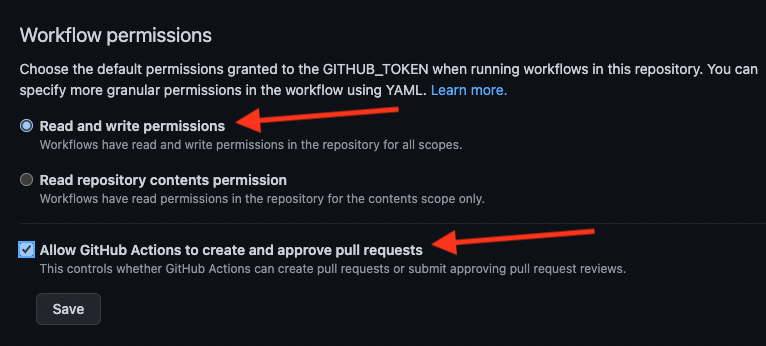

# Update GraphQL Schema 🚀

A Github Action that downloads your GraphQL schema from [introspection](https://graphql.org/learn/introspection/) and/or the [Studio registry](https://www.apollographql.com/docs/studio/) and opens a pull request if anything changed.

This action supports converting an introspection schema to SDL and vice-versa based on the file extension. We recommend using `.graphqls` to convert to SDL. 
### Repository configuration

Allow Workflows to write to your repository and create pull requests:



### Configuring with introspection

```yaml
name: Update GraphQL schema
# Check every night at midnight
on:
  schedule:
    - cron: "0 0 * * *"

jobs:
  update:
    runs-on: ubuntu-20.04
    steps:
      - uses: actions/checkout@v2
      - uses: apollographql/update-graphql-schema@main
        with:
          endpoint: "https://example.com/graphql"
          schema: "src/main/graphql/schema.graphqls"
          
          #  Optional HTTP settings for the download
          headers: '{"Authorization": "Bearer $token", "User-Agent": "MyAction"}' # default: ""
          insecure: "false" # default: "false"

          # Optional pull request settings        
          branch: "graphql-schema" # default: "update-schema"
          remote: "origin" # default: "origin"
          token: "abc123" # Default: GITHUB_TOKEN

          # Optional commit settings
          commit_user_name: My GitHub Actions Bot # defaults to "github-actions[bot]"
          commit_user_email: my-github-actions-bot@example.org # defaults to "github-actions[bot]@users.noreply.github.com"
          commit_author: Author <actions@github.com> # defaults to author of the commit that triggered the run
          commit_message: Automated Commit # defaults to "Update GraphQL Schema"
```


### Configuring with the [Studio registry](https://www.apollographql.com/docs/studio/)

```yaml
name: Update GraphQL schema
on:
  schedule:
    - cron: "0 0 * * *"

jobs:
  update:
    runs-on: ubuntu-20.04
    steps:
      - uses: actions/checkout@v2
      - uses: apollographql/update-graphql-schema@main
        with:
          key: "service:fullstack-tutorial:abc123"
          schema: "src/main/graphql/schema.graphqls"

          # Optional Studio registry settings
          graph: "fullstack-tutorial" # defaults to being parsed from the key
          graph_variant: "production" # default: "current"

          # Other optional settings are the same as for introspection
```
